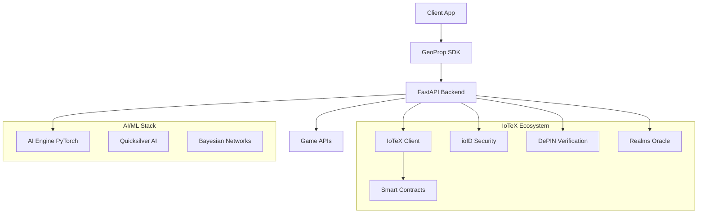

# GeoProp AI 🚀


## Overview

GeoProp AI is a cutting-edge AI as a Service (AIaaS) platform for geo-localized esports prop betting, built on the **IoTeX blockchain ecosystem**. The platform leverages ioID Protocol for decentralized identity, DePIN for device verification, and Quicksilver AI for real-time M2M data processing.

## ✨ Features

- **🔗 IoTeX Blockchain Integration**: Native integration with IoTeX ecosystem (replacing Solana)
- **🆔 ioID Authentication**: Decentralized identity verification with hardware attestation
- **🛡️ DePIN Device Verification**: Hardware-based anti-cheat system
- **🤖 AI-Powered Predictions**: Advanced ML models with <50ms inference time
- **📍 Geo-localized Betting**: Location-based prop betting with geofencing
- **📋 Smart Contract Escrow**: Automated bet settlement on IoTeX
- **⚡ Quicksilver AI Integration**: Real-time M2M data processing
- **🎮 Game Integration**: Native Warzone API support (MVP)

## 🚀 Quick Start

### Prerequisites

- Node.js 18+
- Python 3.11+
- Docker & Docker Compose
- IoTeX wallet (ioPay recommended)

### Installation

1. **Clone the repository:**
   ```bash
   git clone https://github.com/ConWan30/geoprop-ai.git
   cd geoprop-ai
   ```

2. **Copy environment variables:**
   ```bash
   cp .env.example .env
   # Edit .env with your API keys (IoTeX, ioID, DePIN, etc.)
   ```

3. **Install dependencies:**
   ```bash
   # Backend dependencies
   cd backend
   pip install -r requirements.txt

   # Frontend SDK dependencies
   cd ../frontend
   npm install

   # Root project setup
   cd ..
   npm install
   ```

4. **Start development environment:**
   ```bash
   npm run dev
   ```

## 🏗️ Architecture



## 📖 API Documentation

- **Development:** http://localhost:8000/docs
- **API Docs:** [docs/api/README.md](docs/api/README.md)
- **Integration Guide:** [docs/integration/README.md](docs/integration/README.md)

## 🧪 Testing

```bash
# Run all tests (80%+ coverage)
npm test

# Backend tests only
npm run backend:test

# Frontend SDK tests only
npm run frontend:test

# Integration tests
pytest tests/integration/ -v

# Load testing
pytest tests/load/ -v
```

## 🚢 Deployment

### Docker (Recommended)

```bash
# Start all services
npm run deploy:docker

# Or manually
docker-compose -f infrastructure/docker/docker-compose.yml up -d
```

### AWS Production (Terraform)

```bash
# Deploy to AWS
cd infrastructure/terraform
terraform init
terraform plan
terraform apply
```

### Kubernetes

```bash
# Deploy to K8s cluster
kubectl apply -f infrastructure/k8s/
```

## 🔧 Environment Configuration

Key environment variables needed:

```env
# IoTeX Configuration
IOTEX_RPC_URL=https://babel-api.mainnet.iotex.io
IOTEX_PRIVATE_KEY=your_private_key

# ioID Protocol
IOID_API_URL=https://api.ioid.io/v1
IOID_API_KEY=your_ioid_key

# DePIN Network
DEPIN_API_URL=https://api.iotex.io/depin/v1
DEPIN_API_KEY=your_depin_key

# Game APIs
ACTIVISION_API_KEY=your_activision_key

# AWS Infrastructure
AWS_REGION=us-east-1
AWS_ACCESS_KEY_ID=your_access_key
```

## 📊 Tech Stack

**Backend:**
- FastAPI with asyncio
- PyTorch for AI models
- Web3.py for IoTeX integration
- Redis for caching
- DynamoDB for storage

**Frontend:**
- JavaScript/React SDK
- Web3 wallet integration
- IoTeX network switching

**Blockchain:**
- IoTeX mainnet
- Solidity smart contracts
- Multi-signature escrow
- Oracle integration

**AI/ML:**
- PyTorch neural networks
- Scikit-learn ensemble methods
- Bayesian inference
- <50ms prediction latency

## 🎯 Roadmap

- [x] **Phase 1**: IoTeX integration & ioID auth
- [x] **Phase 2**: AI model training & DePIN verification
- [x] **Phase 3**: Smart contract deployment
- [x] **Phase 4**: Frontend SDK & documentation
- [ ] **Phase 5**: Beta launch (skill-gaming markets)
- [ ] **Phase 6**: Multi-game expansion
- [ ] **Phase 7**: Mobile app & advanced analytics

## 🤝 Contributing

1. Fork the repository
2. Create your feature branch (`git checkout -b feature/AmazingFeature`)
3. Commit your changes (`git commit -m 'Add AmazingFeature'`)
4. Push to the branch (`git push origin feature/AmazingFeature`)
5. Open a Pull Request

## 📄 License

This project is licensed under the MIT License - see the [LICENSE](LICENSE) file for details.

## 🙏 Acknowledgments

- **IoTeX Foundation** for blockchain infrastructure
- **ioID Protocol** for decentralized identity
- **DePIN Network** for device verification
- **Quicksilver AI** for M2M data processing
- **Activision** for game API access

---

**Built with ❤️ for the future of esports betting**


