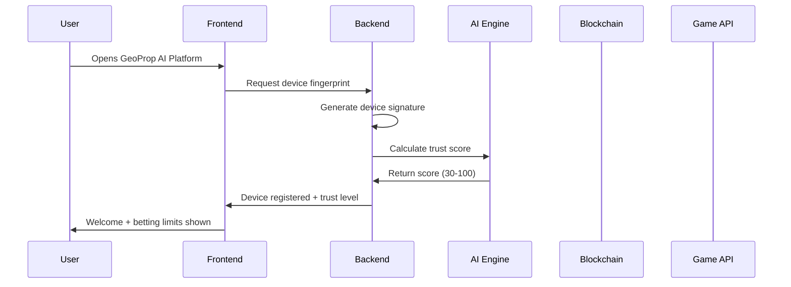
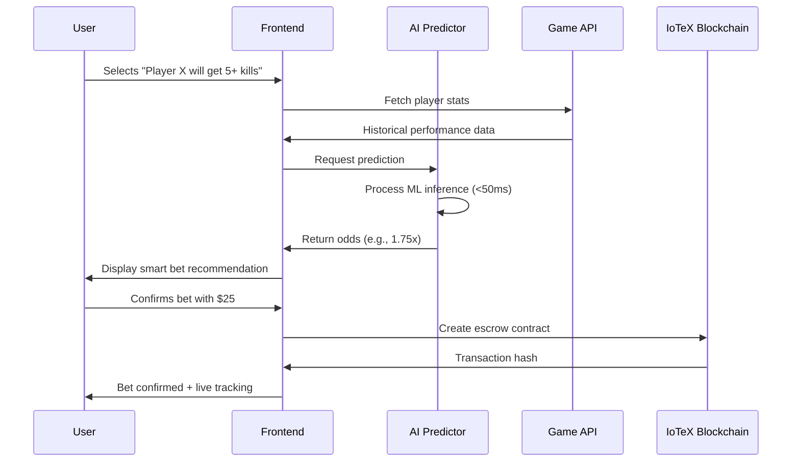
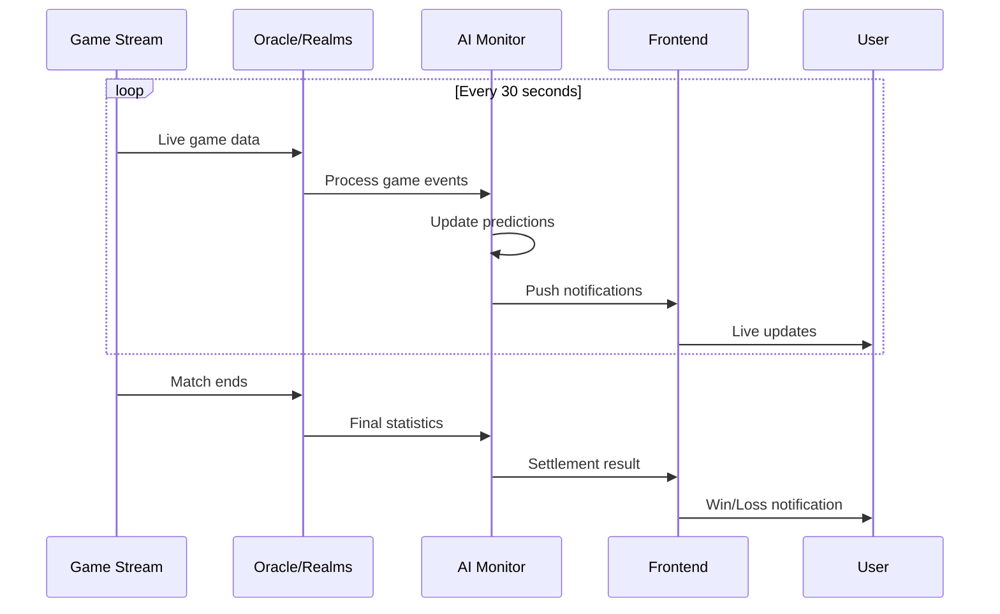

# GeoProp AI Software Workflow

## 🔄 Complete Software Flow

### 1. User Onboarding Flow


### 2. Real-Time Prop Bet Creation


### 3. Live Game Monitoring


## ⚡ Core Software Components

### Device Verification Engine
```python
class DeviceVerificationEngine:
    def __init__(self):
        self.fingerprint_generator = FingerprintGenerator()
        self.trust_calculator = TrustScoreCalculator()
        self.verification_stack = [
            BrowserFingerprintVerifier(),
            NetworkStabilityVerifier(),
            HardwareProfileVerifier(),
            BehavioralAnalyzer(),
            LocationVerifier()
        ]

    async def verify_device(self, user_id: str) -> DeviceProfile:
        # Multi-layer verification without hardware chips
        fingerprint = await self.fingerprint_generator.generate()

        verification_results = {}
        for verifier in self.verification_stack:
            result = await verifier.verify(fingerprint)
            verification_results[verifier.name] = result

        trust_score = self.trust_calculator.calculate(verification_results)

        return DeviceProfile(
            device_id=fingerprint.device_id,
            trust_score=trust_score,
            betting_limits=self.get_betting_limits(trust_score),
            verification_level=self.get_verification_level(trust_score)
        )
```

### AI Prediction Engine
```python
class GeoPropAIEngine:
    def __init__(self):
        self.pytorch_model = self.load_trained_model()
        self.feature_processor = FeatureProcessor()
        self.inference_cache = Redis()

    async def predict_prop_outcome(self, bet_request: PropBetRequest) -> PredictionResult:
        # Sub-50ms AI inference
        start_time = time.time()

        # 1. Feature extraction (20ms)
        features = await self.feature_processor.extract_features(
            player_stats=bet_request.player_data,
            game_context=bet_request.game_data,
            historical_performance=bet_request.history,
            environmental_factors=bet_request.location_data
        )

        # 2. ML inference (15ms)
        with torch.no_grad():
            prediction = self.pytorch_model(features)
            confidence = torch.softmax(prediction, dim=1)

        # 3. Post-processing (10ms)
        odds = self.calculate_fair_odds(prediction, confidence)
        risk_assessment = self.assess_risk(bet_request, prediction)

        inference_time = (time.time() - start_time) * 1000

        return PredictionResult(
            predicted_probability=prediction.item(),
            recommended_odds=odds,
            confidence_score=confidence.max().item(),
            risk_level=risk_assessment,
            inference_time_ms=inference_time
        )
```

### Real-Time Data Pipeline
```python
class RealTimeDataPipeline:
    def __init__(self):
        self.game_apis = {
            'warzone': WarzoneAPI(),
            'apex': ApexAPI(),
            'fortnite': FortniteAPI()
        }
        self.websocket_manager = WebSocketManager()
        self.event_processor = EventProcessor()

    async def start_live_monitoring(self, active_bets: List[PropBet]):
        for bet in active_bets:
            # Create real-time monitoring task
            task = asyncio.create_task(
                self.monitor_bet_progress(bet)
            )

    async def monitor_bet_progress(self, bet: PropBet):
        game_api = self.game_apis[bet.game_type]

        while not bet.is_settled:
            # Fetch live game data every 30 seconds
            live_data = await game_api.get_live_stats(
                match_id=bet.match_id,
                player_id=bet.player_id
            )

            # Process events and update predictions
            events = self.event_processor.extract_events(live_data)
            updated_prediction = await self.ai_engine.update_prediction(
                bet, events
            )

            # Push to frontend via WebSocket
            await self.websocket_manager.broadcast(
                f"bet_{bet.id}",
                {
                    "current_stats": live_data,
                    "updated_prediction": updated_prediction,
                    "time_remaining": bet.estimated_time_remaining
                }
            )

            await asyncio.sleep(30)
```

## 🎯 Smart Software Features

### Intelligent Bet Recommendations
- **AI-Powered Suggestions**: "Player X historically performs 23% better on this map"
- **Risk Assessment**: "This bet has 94% AI confidence - recommended"
- **Dynamic Odds**: Real-time odds adjustment based on live game data

### Social Proof Integration
- **Community Sentiment**: "89% of expert bettors back this prediction"
- **Streamer Insights**: "Popular streamers average 6.2 kills on this map"
- **Historical Patterns**: "Similar conditions led to 78% success rate"

### Gamification Elements
- **Achievement System**: "Prediction Master" badges for accurate bets
- **Leaderboards**: Top predictors and highest earners
- **Streak Bonuses**: Reward consistent winning streaks