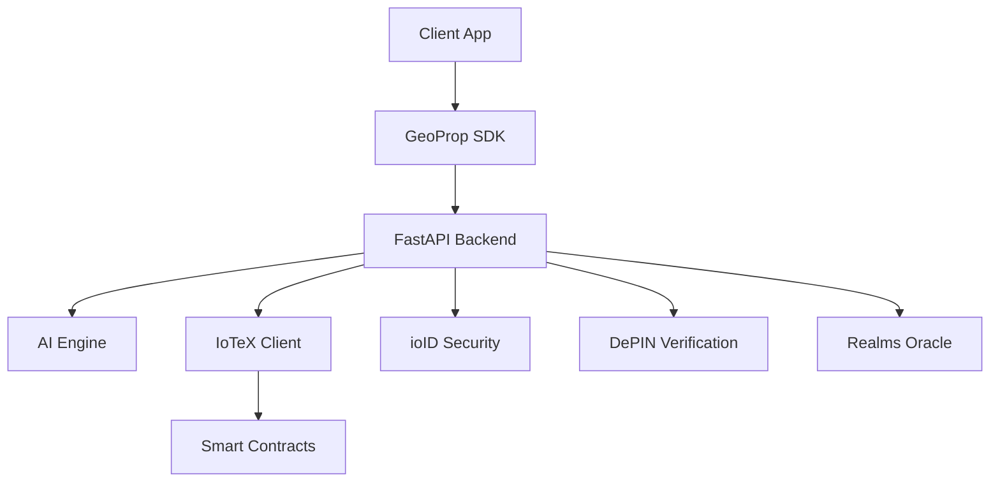

# GeoProp AI 
 
 
 
## Overview 
 
GeoProp AI is a cutting-edge AI as a Service (AIaaS) platform for geo-localized esports prop betting, built on the IoTeX blockchain ecosystem. The platform leverages ioID Protocol for decentralized identity, DePIN for device verification, and Quicksilver AI for real-time M2M data processing. 
 
## Features 
 
- **IoTeX Blockchain Integration**: Native integration with IoTeX ecosystem 
- **ioID Authentication**: Decentralized identity verification 
- **DePIN Device Verification**: Hardware-based anti-cheat system 
- **AI-Powered Predictions**: Advanced ML models for prop bet analysis 
- **Geo-localized Betting**: Location-based prop betting system 
- **Smart Contract Escrow**: Automated bet settlement 
- **Realtime Data Processing**: Quicksilver AI integration 
 
## Quick Start 
 
### Prerequisites 
 
- Node.js 18+ 
- Python 3.11+ 
- Docker & Docker Compose 
- IoTeX wallet (ioPay) 
 
### Installation 
 
1. Clone the repository: 
   ```bash 
   git clone https://github.com/your-username/geoprop-ai.git 
   cd geoprop-ai 
   ``` 
 
2. Copy environment variables: 
   ```bash 
   cp .env.example .env 
   ``` 
 
3. Install dependencies: 
   ```bash 
   # Backend 
   cd backend 
   pip install -r requirements.txt 
 
   # Frontend 
   cd ../frontend 
   npm install 
   ``` 
 
4. Start the development environment: 
   ```bash 
   npm run dev 
   ``` 
 
## Architecture 
 

 
## API Documentation 
 
API documentation is available at `http://localhost:8000/docs` when running the development server. 
 
## Testing 
 
```bash 
# Run all tests 
npm test 
 
# Backend tests only 
npm run backend:test 
 
# Frontend tests only 
npm run frontend:test 
``` 
 
## Deployment 
 
### Docker 
 
```bash 
npm run deploy:docker 
``` 
 
### AWS (Terraform) 
 
```bash 
npm run deploy:terraform 
``` 
 
## License 
 
MIT License - see [LICENSE](LICENSE) file for details. 
